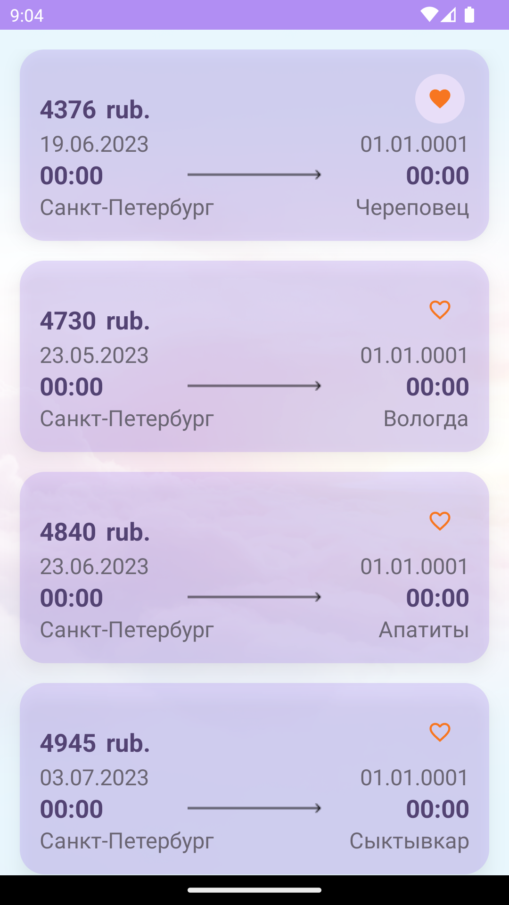
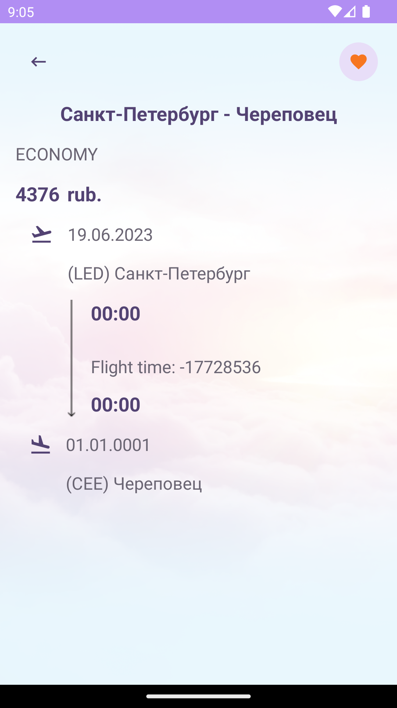

## Тестовое задание от компании Wildberries

### Первый экран ###

Содержит список актуальных дешевых авиаперелетов:
- Город отправления.
- Город прибытия.
- Дата отправления.
- Дата возвращения.
- Цена в рублях.
- Иконка “Лайк” (имеет два состояния).

### Второй экран ###

*Расчётное время отображается неверно, т.к. сервер присылает дату прилёта 01.01.0001. При верных данных функция рассчитывает время корректно.

- Открывается при выборе одной из ячеек первого экрана. 
- Добавлена возможность вернуться к первому экрану назад.
- Содержит данные по выбранному перелету.
